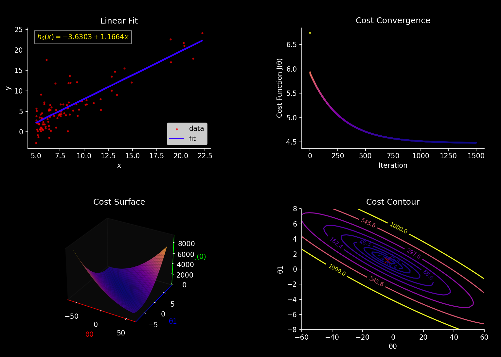

# Linear Regression

This module implements univariate linear regression from scratch using gradient descent.  
Focus is on understanding the update rule, the shape of the cost function, and the behavior of the model during optimization.

### Result
Below is the fitted line visualization generated in this stage:

