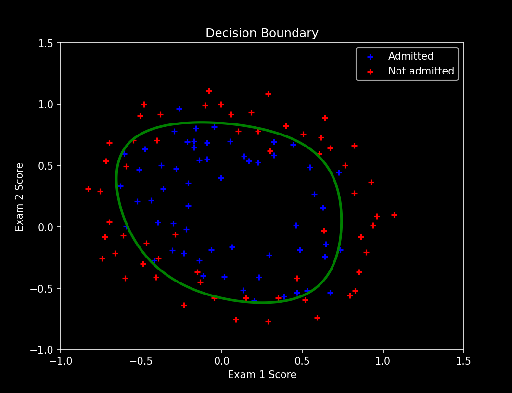

# ML-Progression-Lab

## Overview | 项目概述
A structured repository designed to record, systematize, and reflect on the learning process of core machine learning concepts.  
it functions as an academically oriented learning log.

一个用于记录、整理并反思机器学习核心概念学习过程的结构化仓库。  
作为一个具有学术导向的学习记录体系。

## Objectives | 项目目标
Build a coherent and traceable study path.  
Reinforce theoretical understanding through derivation and implementation.  
Maintain reproducible code examples for future reference.

构建连贯且可追溯的学习路径。  
通过推导与实现加深理论理解。  
保持可复现的代码示例以供未来参考。

## Linear Regression
### univariate

### multivariate

### interactive

## Logistic Regression
### linear

### nonlinear

### interactive

